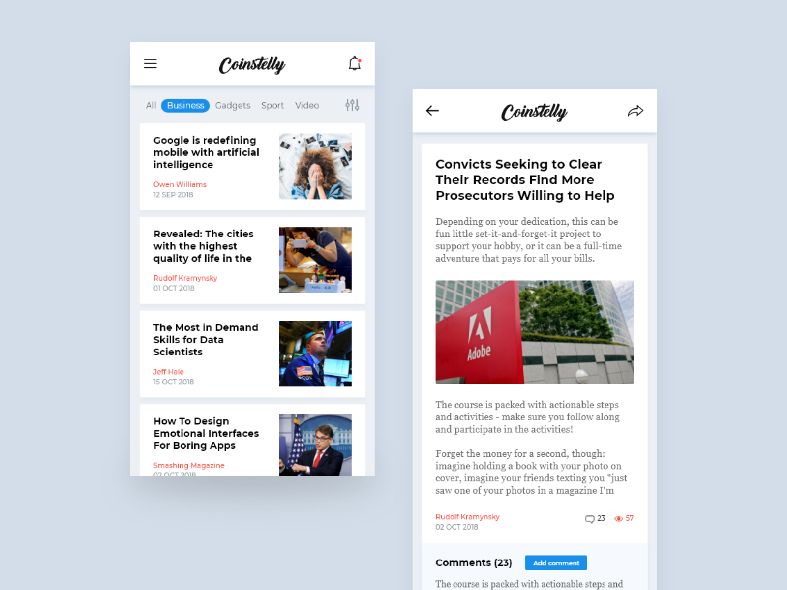

# News Feed Project

Refer to below design created created by Diana Tomka and recreate each screen within a single android application. Please be sure to implement your app in as close to the design as possible. Your ability to recreate screens in accordance with mockups will be weighted heavily. Use dummy placeholder icons as replacements for any assets within this mockup.

The original design can be found on [dribbble](https://dribbble.com/shots/5397905-News-App).

## Requirements

Develop a full feed containing interactive posts in accordance to the following requirements.

- Fork this repo and create a new branch before making any changes
- Frequently commit your changes to GIT, with proper messages on each commit.
- Colors should be the same hex/rgb values that appear within the screenshots
- Code should be well documented, with adequate comments explaining relevant sections.
- Use placeholder icons for the menu, notification, and logo images that are present within the header. Upon scrolling, the header should be fixed.
- You do not need to create the horizontal menu with the categories listed and filter icon present.
- Using a news API or news RSS feed, make HTTP calls to fetch articles that will be displayed in your news feed.
- Create each post contained within the feed.
- Each post within the feed should contain the title, author, date, and image associated with the article. In the event that the date or author is not easily parsable, use dummy data as placeholders.
- Upon tapping each post within the feed, you should bring up the second more detailed screen. The detailed screen should display the title, author, date, and image associated with the article tapped from the feed. Use the description associated with the article as the body text (if one is not present, use LOREM IPSUM).
- You do not need to create the comment section that is present within the design, this includes the comment count and view count.
- Once you are finished, create a pull request into this same repo.
- Please create a preview video of your application using a screen recording program of your choosing. Send your screen recording as a link or attachment when responding back to the email that assigned you this task.

## BONUS
- Create the horizontal sliding menu (without the filter icon). Make it so that tapping each category loads a different or reloads the same set of articles.

## Submitting
If you have any questions about the tech or design specifications or have submitted your application as a pull request, please respond to the email address that sent you this task.
